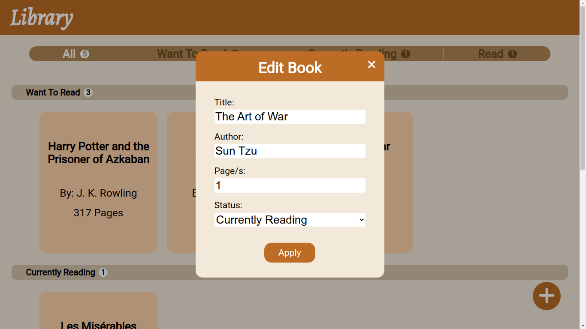

<h1 align="center">Library</h1>
<h3 align="center"><a href="https://gaaabbb.github.io/library/">:film_projector: Live Demo</a></h3>

## :scroll: Description
This project, which was created as part of TheOdinProject's JavaScript Course, is a Library where you can store your books and sort them according to whether you plan to read, currently reading, or have read them.

## :pencil2: Features
* Add a book by getting input from users.
* Store books seperately by their status.
* A top bar (or menu for smaller screens) to navigate to the selected status.
* See total amount of books.
* Edit books and their status.
* Delete books.
* Responsive design and works on all devices.

## :framed_picture: Gallery
#### Books

#### Add Book

#### Edit Book

#### Change Status

## :computer: Languages Used
* HTML
* CSS
* JavaScript

## :left_speech_bubble: Reflection
I started doing this project on June 24, 2022 and finished it in a week. It took me a long time working out on the logic of storing data in objects and I implemented and changed a lot of things. I think it was around 3 days ago that I actually finished this project, however my code really looked like spaghetti which has more than 350 lines. Realizing that, I tried to modify lots of things to really make my code as minimal and clean as possible. Though I will not call my code the cleanest code possible, I still did my best to reduce the lines and still make it functional and readable for me. I had fun doing this and I think this is my most favorite project to do as of now due to lots of challenges, trials, and errors I faced and overcame.